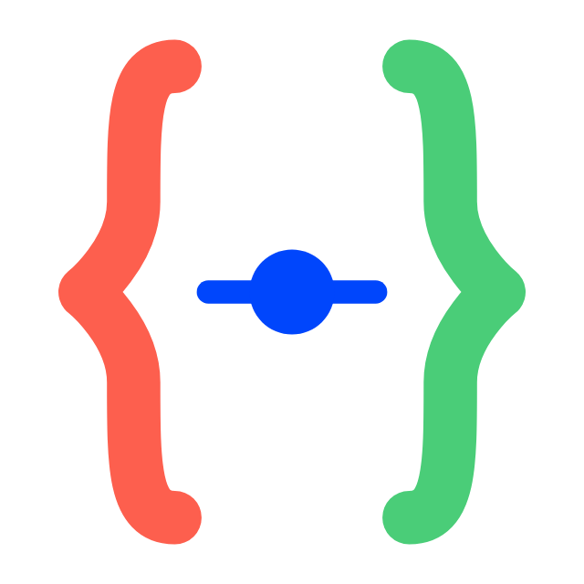
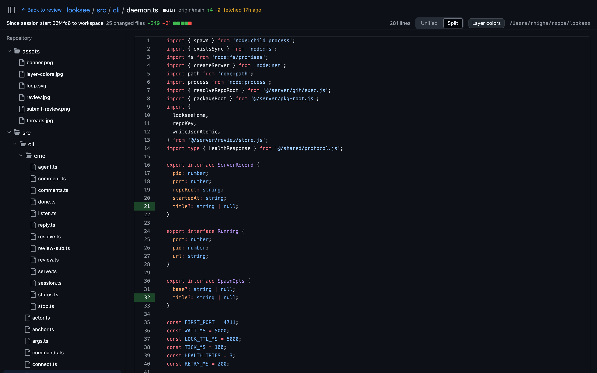
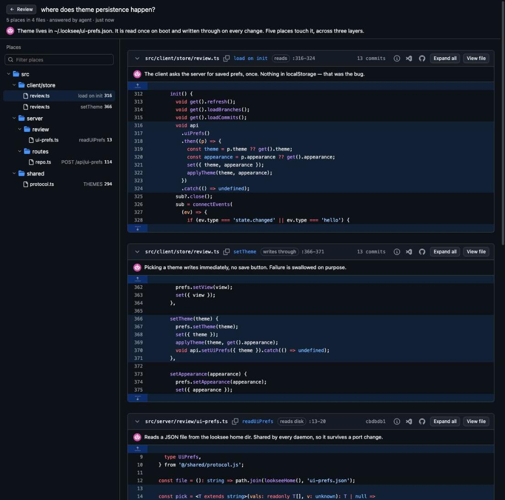

<p align="center"></p>

<h1 align="center">looksee</h1>

<p align="center"><strong>Review your agent work before every push.</strong></p>

<p align="center">
  <a href="https://www.npmjs.com/package/@rhighs-lab/looksee"></a>
  <a href="LICENSE"></a>
  
</p>

<p align="center"></p>

## Install

```bash
curl -fsSL https://raw.githubusercontent.com/rhighs-lab/looksee/main/install.sh | bash
```

**npm**:

```bash
npm install -g @rhighs-lab/looksee
```

**npx**:

```bash
npx @rhighs-lab/looksee review .
```

**Agent skill** (teaches any supported agent to use looksee):

```bash
npx skills add rhighs-lab/looksee
```

**From source**:

```bash
git clone https://github.com/rhighs-lab/looksee && cd looksee
pnpm install
pnpm link --global
```

## Use

```bash
cd some-repo
looksee review .
looksee status --pretty
looksee stop
```

looksee review starts a daemon in the invoked location, any of the looksee 
review commands are contextual for that the repo only.

## Features


**Live diff of the working tree.** Every change since your last look 
is included updated live as files get new edit chunks.

Diff comparison modes include:
- Session start: a snapshot of the workspace pinned when the server opened.
- Last approval: the snapshot pinned when you last approved a review.
- Working tree: HEAD to workspace, the classic `git diff`.
- Branch: merge base with the detected base branch.
- Any ref: a branch or tag against the workspace.


**Comments and suggestions.**


**Pending reviews, like GitHub.**


**Layer colors:** staged, unstaged and untracked edits inside a hunk are told apart at a glance.



**File view.** 



**Code answers.** Ask an agent where something happens and it answers here, as code, instead of a list of paths.

```sh
looksee answer "who calls git()?" \
  --hit src/server/git/refs.ts:10-14 --why "every ref lookup funnels here"
```

Larger answers go in as JSON on stdin, which is the path an agent takes:

```sh
echo '{"question":"...","summary":"markdown","hits":[
  {"path":"src/a.ts","startLine":10,"endLine":20,
   "symbol":"readPrefs","role":"reads disk","why":"..."}]}' | looksee answer
```

## Agents

`looksee init` writes a standing rule into the instruction file of every
agent installed on the machine (`CLAUDE.md`, Codex's `AGENTS.md`,
`GEMINI.md`, opencode), or into this repo's `AGENTS.md` with `--local`. The
rule tells the agent to offer a review after a set of changes and how to
work the comment loop. `looksee agent` prints the full guide.

### Codex and other turn-based harnesses

A turn-based agent only runs while it is answering. Output from a process
it left in the background is buffered, not delivered: it never starts a new
turn. So `looksee listen` in the background is not monitoring, and the
installed rule never asks for it.

The rule uses a bounded poll in the foreground instead:

```bash
looksee listen --not-me --pending --wait 60
```

It prints anything still unanswered, then blocks until one event arrives or
the timeout ends, and exits. The agent acts, replies, and runs it again.
When the round is still open as its turn ends, the agent says so and asks
for a message to resume. A comment left while the agent is idle is picked
up by the next poll, which the user's next message triggers.

Drop `--wait` only on a host that can wake an idle agent on process output;
there the stream itself is the subscription.

## CLI

| Command | What it does |
| --- | --- |
| `looksee review [path]` | Start the server for a repo and open the browser |
| `looksee review . --title <name>` | Name this review in the browser tab |
| `looksee review . --scope <preset>` | Open on `session`, `working` or `branch` |
| `looksee status` | Server, pending reviews, open threads and session pins |
| `looksee stop` | Shut down the server for this repo |
| `looksee ps` | List the looksee servers running on this machine |
| `looksee listen` | Print review events as JSON lines; `--wait <s>` returns after the first one |
| `looksee comments` | List threads with replies and an `expects` hint |
| `looksee reply <id> [body]` | Reply to a thread, body from the argument or stdin |
| `looksee resolve <id>` | Mark a thread resolved |
| `looksee comment <file>:<line>[-<line>] <body>` | Post a single comment outside a review |
| `looksee answer [question] --hit <file>:<line>` | Publish a code answer as a navigable map |
| `looksee review start` | Open a pending review for the actor |
| `looksee review comment <file>:<line> <body>` | Add a draft to the pending review |
| `looksee review submit --verdict <v> [body]` | Submit with `comment`, `approve` or `request_changes` |
| `looksee review discard` | Drop the pending review and its drafts |
| `looksee review show` | Print the pending review and its drafts |
| `looksee pin` | Re-pin the session to the current workspace |
| `looksee scope [session\|working\|branch]` | Set or print the default comparison |
| `looksee session end` | End the session and drop its pins |
| `looksee agent` | Print the agent guide |
| `looksee init` | Add the looksee review rule to `AGENTS.md` |
| `looksee serve --repo .` | Run the server in the foreground |

## Development

[CONTRIBUTING.md](CONTRIBUTING.md).

## Credits

Inspired by [prequel](https://github.com/mdesjardins/prequel).

## License

[MIT](LICENSE) (c) Roberto Montalti

Bundled fonts ([Literata](https://github.com/googlefonts/literata)) are
licensed under the [SIL Open Font License 1.1](https://openfontlicense.org).
