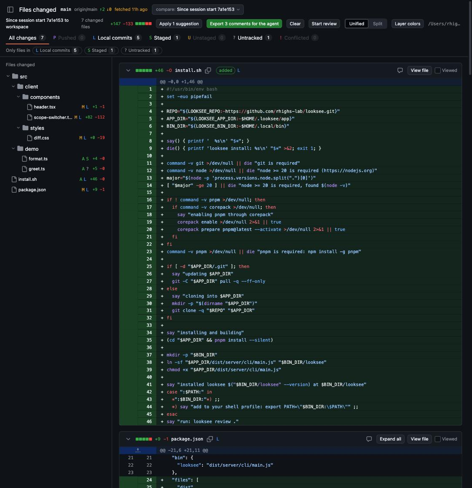
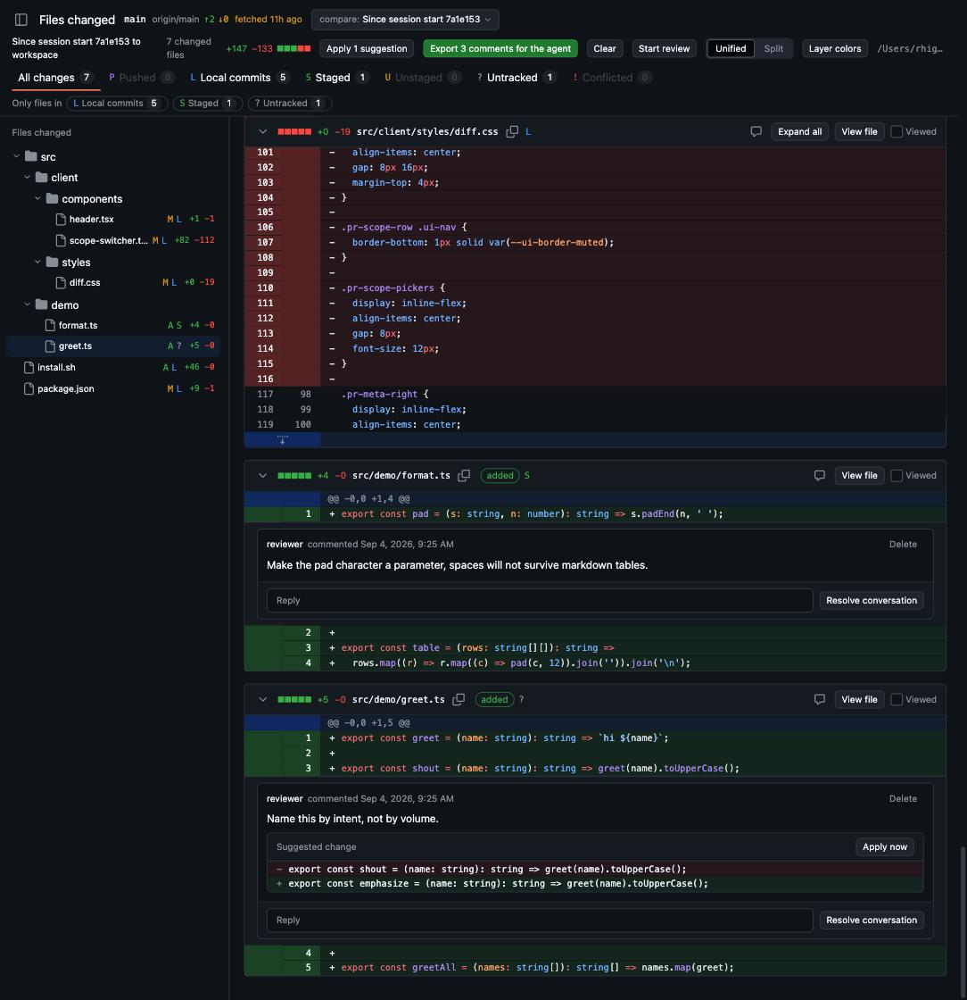
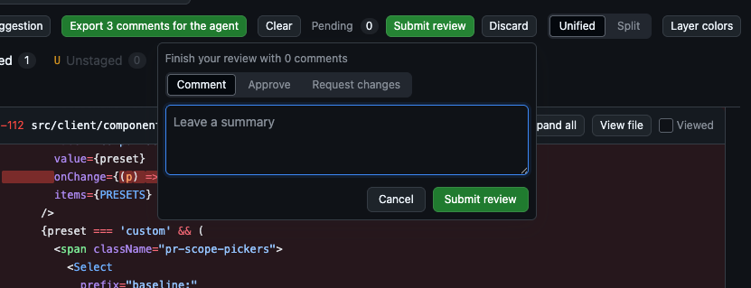
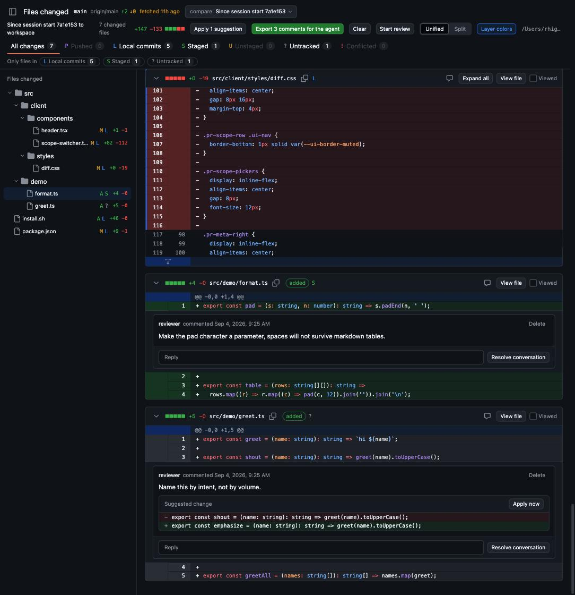

<p align="center"><strong>Review your work before every push.</strong></p>

A GitHub-style diff of your working tree that updates live while your coding
agent edits. Comment, suggest, request changes; the agent listens and fixes.

<p align="center"></p>

## Install

Pick one. All three give you a `looksee` command; node 20 or newer is required.

**Script** (clones into `~/.looksee/app`, links `~/.local/bin/looksee`):

```bash
curl -fsSL https://raw.githubusercontent.com/rhighs-lab/looksee/main/install.sh | bash
```

**npm**:

```bash
npm install -g @rhighs-lab/looksee
# or without installing
npx @rhighs-lab/looksee review .
```

**From source** (`pnpm install` also builds):

```bash
git clone https://github.com/rhighs-lab/looksee && cd looksee
pnpm install
pnpm link --global        # or: pnpm looksee review ../your-repo
```

## Use

```bash
cd your-repo
looksee review .          # starts a daemon for this repo, opens the browser
looksee status --pretty   # url, pending reviews, open threads, session pins
looksee stop
```

One daemon per repo, found again by path, so every command below works from
anywhere inside the repo. `looksee --help` and `looksee <command> --help`
document everything; the CLI is meant to be self-teaching.

## Features



**Live diff of the working tree.** Every change since your last look, updated
as files are saved. The tree groups files by folder, each file carries the git
layers it touches (Pushed, Local commits, Staged, Unstaged, Untracked,
Conflicted) and the tabs filter by layer. Files with no net change are hidden.
Mark files as viewed, collapse hunks, expand context, switch unified and split.

**Since your last look, not since the branch.** The `compare:` dropdown picks
what the diff is measured against:

- Session start: a snapshot of the workspace pinned when the server opened.
- Last approval: the snapshot pinned when you last approved a review.
- Working tree: HEAD to workspace, the classic `git diff`.
- Branch: merge base with the detected base branch.
- Any ref: a branch or tag against the workspace.

Approving a review moves the pin forward, so the next round only shows what
changed since. `looksee pin` re-pins by hand, `looksee scope` sets the default.
If HEAD moves under a pin, a notice says so and the diff keeps working.



**Comments and suggestions.** Click a line or drag a range to comment.
Markdown bodies, and a ```suggestion block renders as a diff with an
Apply now button that writes the file. Threads resolve and reopen; the
whole set can be exported as a block to paste into an agent prompt.



**Pending reviews, like GitHub.** Start review batches comments as drafts you
can edit or drop, then Submit with a verdict: comment, approve, request
changes. Approving advances the session pin. Agents get the same flow from the
CLI, so an agent can review another agent's work.



**Layer colors.** Off by default. Turned on, each added or removed line is
tinted by the git layer that introduced it, so staged, unstaged and untracked
edits inside one hunk are told apart at a glance.

## CLI

Every command prints JSON unless `--pretty` is given. `--as <name>` names the
actor (default `LOOKSEE_ACTOR`, then `agent`); `user` is reserved for the
browser.

| Command | What it does |
| --- | --- |
| `looksee review [path]` | Start the server for a repo and open the browser |
| `looksee status` | Server, pending reviews, open threads and session pins |
| `looksee stop` | Shut down the server for this repo |
| `looksee listen` | Stream review events as JSON lines until killed |
| `looksee comments` | List threads with replies and an `expects` hint |
| `looksee reply <id> [body]` | Reply to a thread, body from the argument or stdin |
| `looksee resolve <id>` | Mark a thread resolved |
| `looksee comment <file>:<line>[-<line>] <body>` | Post a single comment outside a review |
| `looksee done [body]` | Record that the actor addressed the current round |
| `looksee review start` | Open a pending review for the actor |
| `looksee review comment <file>:<line> <body>` | Add a draft to the pending review |
| `looksee review submit --verdict <v> [body]` | Submit with `comment`, `approve` or `request_changes` |
| `looksee review discard` | Drop the pending review and its drafts |
| `looksee review show` | Print the pending review and its drafts |
| `looksee pin` | Re-pin the session to the current workspace |
| `looksee scope [session\|working\|branch]` | Set or print the default comparison |
| `looksee session end` | End the session and drop its pins |
| `looksee agent` | Print the agent guide |
| `looksee serve --repo .` | Run the server in the foreground |

## Agents

No skill or plugin to install. Point any agent at the CLI:

```bash
looksee listen --not-me --pending
```

It prints a `hello` line with the guide, replays unanswered threads, then one
JSON line per event: `review.submitted`, `comment.created`, `comment.replied`,
`thread.resolved`, `thread.reopened`, `done.requested`. Every comment carries
an `expects` hint saying what the reviewer wants back.

```json
{"type":"comment.created","comment":{"id":"c1","filePath":"src/a.ts",
  "startLine":3,"body":"Guard the null case","expects":"fix and reply"}}
```

The agent fixes, then `looksee reply c1 "Applied in 3f2a1c"`, `looksee
resolve c1`, and `looksee done` when the round is addressed. To have an agent
review instead of being reviewed:

```bash
looksee review start --as critic
looksee review comment src/a.ts:12 "Rename to cfg" --as critic
looksee review submit --verdict request_changes "Two nits" --as critic
```

looksee stores its pins under `refs/looksee/*` in the repo; `looksee session
end` removes them. Review data lives in `~/.looksee` (override with
`LOOKSEE_HOME`).

## Credits

Inspired by [prequel](https://github.com/mdesjardins/prequel).
