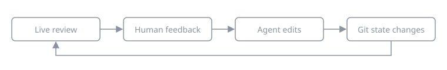

<p align="center"><strong>Review your work before every push.</strong></p>

A GitHub-style diff of your working tree that updates live while your coding
agent edits.

<p align="center"></p>

## Quick start

```bash
git clone https://github.com/rhighs-lab/looksee
cd looksee && pnpm install && pnpm build && pnpm link --global
cd ../your-repo && looksee review .   # opens http://127.0.0.1:4711
```

```
looksee --help
```

## Agents

Run `looksee listen --not-me --pending` in the background and act on each
JSON line; `looksee agent` prints the full guide. looksee writes
`refs/looksee/*` in the repo for its review pins; `looksee session end`
removes them. An event looks like:

```json
{"type":"comment.created","comment":{"id":"c1","filePath":"src/a.ts",
  "startLine":3,"body":"Guard the null case","expects":"fix and reply"}}
```

## Credits

Inspired by [prequel](https://github.com/mdesjardins/prequel).
